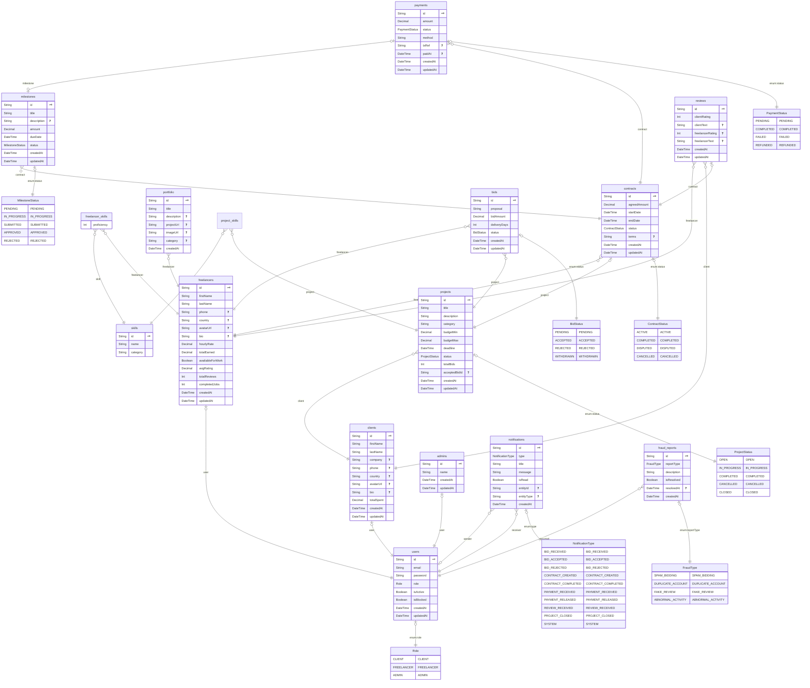

```mermaid
erDiagram

        Role {
            CLIENT CLIENT
FREELANCER FREELANCER
ADMIN ADMIN
        }
    


        ProjectStatus {
            OPEN OPEN
IN_PROGRESS IN_PROGRESS
COMPLETED COMPLETED
CANCELLED CANCELLED
CLOSED CLOSED
        }
    


        BidStatus {
            PENDING PENDING
ACCEPTED ACCEPTED
REJECTED REJECTED
WITHDRAWN WITHDRAWN
        }
    


        ContractStatus {
            ACTIVE ACTIVE
COMPLETED COMPLETED
DISPUTED DISPUTED
CANCELLED CANCELLED
        }
    


        PaymentStatus {
            PENDING PENDING
COMPLETED COMPLETED
FAILED FAILED
REFUNDED REFUNDED
        }
    


        MilestoneStatus {
            PENDING PENDING
IN_PROGRESS IN_PROGRESS
SUBMITTED SUBMITTED
APPROVED APPROVED
REJECTED REJECTED
        }
    


        NotificationType {
            BID_RECEIVED BID_RECEIVED
BID_ACCEPTED BID_ACCEPTED
BID_REJECTED BID_REJECTED
CONTRACT_CREATED CONTRACT_CREATED
CONTRACT_COMPLETED CONTRACT_COMPLETED
PAYMENT_RECEIVED PAYMENT_RECEIVED
PAYMENT_RELEASED PAYMENT_RELEASED
REVIEW_RECEIVED REVIEW_RECEIVED
PROJECT_CLOSED PROJECT_CLOSED
SYSTEM SYSTEM
        }
    


        FraudType {
            SPAM_BIDDING SPAM_BIDDING
DUPLICATE_ACCOUNT DUPLICATE_ACCOUNT
FAKE_REVIEW FAKE_REVIEW
ABNORMAL_ACTIVITY ABNORMAL_ACTIVITY
        }
    
  "users" {
    String id "🗝️"
    String email 
    String password 
    Role role 
    Boolean isActive 
    Boolean isBlocked 
    DateTime createdAt 
    DateTime updatedAt 
    }
  

  "clients" {
    String id "🗝️"
    String firstName 
    String lastName 
    String company "❓"
    String phone "❓"
    String country "❓"
    String avatarUrl "❓"
    String bio "❓"
    Decimal totalSpent 
    DateTime createdAt 
    DateTime updatedAt 
    }
  

  "freelancers" {
    String id "🗝️"
    String firstName 
    String lastName 
    String phone "❓"
    String country "❓"
    String avatarUrl "❓"
    String bio "❓"
    Decimal hourlyRate 
    Decimal totalEarned 
    Boolean availableForWork 
    Decimal avgRating 
    Int totalReviews 
    Int completedJobs 
    DateTime createdAt 
    DateTime updatedAt 
    }
  

  "admins" {
    String id "🗝️"
    String name 
    DateTime createdAt 
    DateTime updatedAt 
    }
  

  "skills" {
    String id "🗝️"
    String name 
    String category 
    }
  

  "freelancer_skills" {
    Int proficiency 
    }
  

  "portfolio" {
    String id "🗝️"
    String title 
    String description "❓"
    String projectUrl "❓"
    String imageUrl "❓"
    String category "❓"
    DateTime createdAt 
    }
  

  "projects" {
    String id "🗝️"
    String title 
    String description 
    String category 
    Decimal budgetMin 
    Decimal budgetMax 
    DateTime deadline 
    ProjectStatus status 
    Int totalBids 
    String acceptedBidId "❓"
    DateTime createdAt 
    DateTime updatedAt 
    }
  

  "project_skills" {

    }
  

  "bids" {
    String id "🗝️"
    String proposal 
    Decimal bidAmount 
    Int deliveryDays 
    BidStatus status 
    DateTime createdAt 
    DateTime updatedAt 
    }
  

  "contracts" {
    String id "🗝️"
    Decimal agreedAmount 
    DateTime startDate 
    DateTime endDate 
    ContractStatus status 
    String terms "❓"
    DateTime createdAt 
    DateTime updatedAt 
    }
  

  "milestones" {
    String id "🗝️"
    String title 
    String description "❓"
    Decimal amount 
    DateTime dueDate 
    MilestoneStatus status 
    DateTime createdAt 
    DateTime updatedAt 
    }
  

  "payments" {
    String id "🗝️"
    Decimal amount 
    PaymentStatus status 
    String method 
    String txRef "❓"
    DateTime paidAt "❓"
    DateTime createdAt 
    DateTime updatedAt 
    }
  

  "reviews" {
    String id "🗝️"
    Int clientRating 
    String clientText "❓"
    Int freelancerRating "❓"
    String freelancerText "❓"
    DateTime createdAt 
    DateTime updatedAt 
    }
  

  "notifications" {
    String id "🗝️"
    NotificationType type 
    String title 
    String message 
    Boolean isRead 
    String entityId "❓"
    String entityType "❓"
    DateTime createdAt 
    }
  

  "fraud_reports" {
    String id "🗝️"
    FraudType reportType 
    String description 
    Boolean isResolved 
    DateTime resolvedAt "❓"
    DateTime createdAt 
    }
  
    "users" |o--|| "Role" : "enum:role"
    "clients" |o--|| users : "user"
    "freelancers" |o--|| users : "user"
    "admins" |o--|| users : "user"
    "freelancer_skills" }o--|| freelancers : "freelancer"
    "freelancer_skills" }o--|| skills : "skill"
    "portfolio" }o--|| freelancers : "freelancer"
    "projects" |o--|| "ProjectStatus" : "enum:status"
    "projects" }o--|| clients : "client"
    "project_skills" }o--|| projects : "project"
    "project_skills" }o--|| skills : "skill"
    "bids" |o--|| "BidStatus" : "enum:status"
    "bids" }o--|| projects : "project"
    "bids" }o--|| freelancers : "freelancer"
    "contracts" |o--|| "ContractStatus" : "enum:status"
    "contracts" |o--|| projects : "project"
    "contracts" }o--|| freelancers : "freelancer"
    "milestones" |o--|| "MilestoneStatus" : "enum:status"
    "milestones" }o--|| contracts : "contract"
    "payments" |o--|| "PaymentStatus" : "enum:status"
    "payments" }o--|| contracts : "contract"
    "payments" |o--|o milestones : "milestone"
    "reviews" |o--|| contracts : "contract"
    "reviews" }o--|| clients : "client"
    "reviews" }o--|| freelancers : "freelancer"
    "notifications" |o--|| "NotificationType" : "enum:type"
    "notifications" }o--|| users : "receiver"
    "notifications" }o--|o users : "sender"
    "fraud_reports" |o--|| "FraudType" : "enum:reportType"
    "fraud_reports" }o--|| users : "reported"
```
